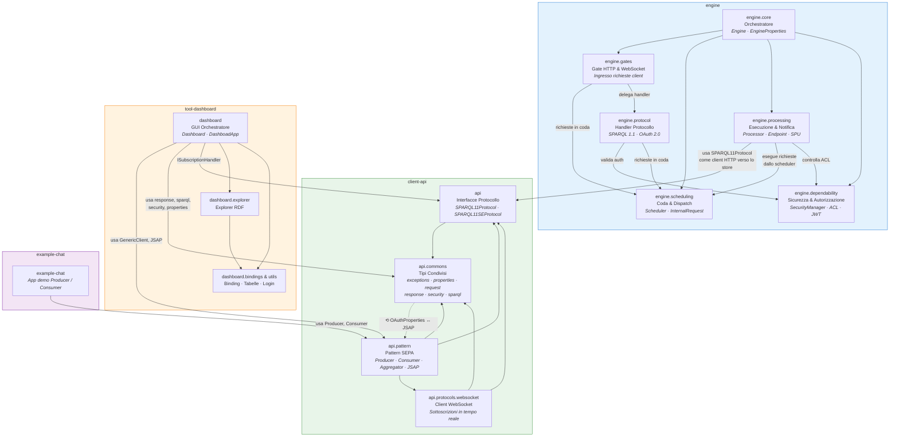

# Architettura ad Alto Livello — SEPA

Diagramma UML dei package con sintassi Mermaid.js. Mostra i package principali dei 4 moduli Maven e le loro dipendenze.



## Legenda

| Freccia | Significato |
|---------|------------|
| `──►` | Dipendenza diretta (importa classi dal package target) |
| `- -►` | Dipendenza circolare (vedi note sotto) |
| Colore verde | Modulo `client-api` |
| Colore blu | Modulo `engine` |
| Colore arancio | Modulo `tool-dashboard` |
| Colore viola | Modulo `example-chat` |

## Note architetturali

### Dipendenze circolari

- **`api.commons.security` ↔ `api.pattern`**: `OAuthProperties` (in security) importa `JSAP` (in pattern), mentre i client in `pattern` importano `ClientSecurityManager`. La freccia tratteggiata evidenzia il verso "controcorrente" rispetto al layering ideale.
- **`engine.processing` ↔ `engine.processing.subscriptions`**: `Processor` trattiene un riferimento a `SPUManager` e viceversa (non visibile a questo livello di aggregazione — i due sub-package sono collassati in `engine.processing`).

### Flusso dati principale

```
Client → gates (HTTP/WS) → scheduling (coda) → processing (esecuzione) → endpoint → SPARQL Store
                                                                      ↓
                                                        subscriptions (SPU) → notifica → gates → Client
```

1. Un client invia una richiesta SPARQL via HTTP o una sottoscrizione via WebSocket
2. I **gates** ricevono la richiesta e la incodano nello **scheduler**
3. Lo **scheduler** la dispatcha al **processor**
4. Il processor esegue la query/update sull'**endpoint** (Jena in-memory o remoto via `SPARQL11Protocol`)
5. Dopo un update, lo **SPUManager** rivaluta le sottoscrizioni attive e notifica i client tramite i loro gate

### Isolamento del dashboard

`tool-dashboard` non ha alcuna dipendenza compile-time verso `engine.*`. Comunica con l'engine esclusivamente tramite `client-api` (protocollo SPARQL 1.1 SE su HTTP/WebSocket).

### Punto di integrazione engine ↔ client-api

`engine.processing.endpoint.RemoteEndpoint` usa `api.SPARQL11Protocol` come client HTTP per inoltrare query/update allo store SPARQL remoto (es. Blazegraph). Questa è l'unica dipendenza diretta dell'engine verso il client-api a runtime.
