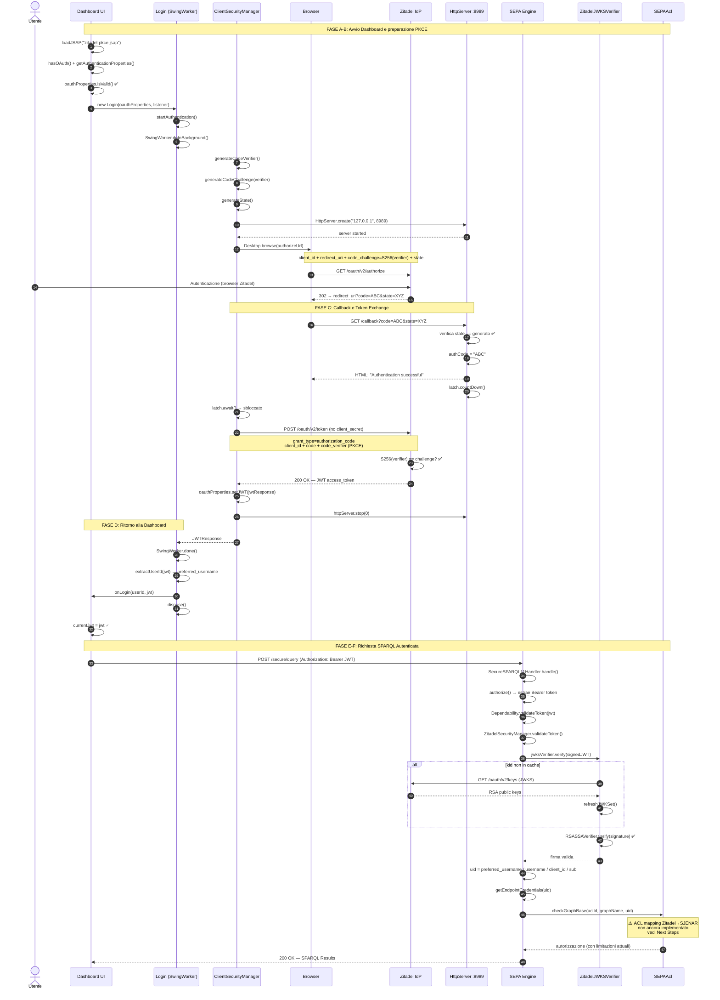

# SEPA Authentication Flow Report — Zitadel PKCE

> **Autore:** Principal Software Architect
> **Data:** Maggio 2026
> **Versione:** 1.0
> **Stato:** Implementazione Fasi 1-3 completata — Fase ACL in progettazione

---

## Introduzione Esecutiva

La migrazione del sistema SEPA dal flusso OAuth2 Machine-to-Machine (`client_credentials`) all'**Authorization Code Flow con PKCE** per utenti umani, integrato con **Zitadel** come Identity Provider, è stata completata con successo su tutti e tre i moduli dell'architettura: `client-api`, `tool-dashboard` e `engine`.

Il nuovo flusso trasforma l'applicazione desktop Swing in un **Public Client OAuth2** conforme agli standard RFC 7636 (PKCE). L'utente si autentica tramite il browser di sistema su Zitadel; il client non custodisce mai un `client_secret`. La sicurezza è garantita dal meccanismo **S256 code_challenge / code_verifier**, dalla protezione anti-CSRF via `state` parameter, e dalla validazione **JWKS (JSON Web Key Set)** lato engine, che elimina la necessità di chiamate di rete a Zitadel per ogni richiesta SPARQL.

Questo documento traccia il percorso completo dell'autenticazione dal caricamento della Dashboard fino alla validazione del JWT sull'Engine, e delinea i passi successivi per completare l'integrazione con il sistema autorizzativo RDF interno (SEPAAcl / SJENAR).

---

## Flusso Cronologico — Happy Path

### FASE A — Avvio e Caricamento Configurazione (tool-dashboard)

**A1. `Dashboard.loadJSAP()`** — La Dashboard legge il file `zitadel-pkce.jsap` dal classpath. Gson deserializza il JSON in un oggetto `JSAP`, che estrae il blocco `oauth` contenente `provider`, `authorizationEndpoint`, `tokenRequest`, `redirectUri` e `client_id`. Il metodo chiama `JSAP.hasOAuth()` per verificare la presenza dei campi obbligatori; se assente, mostra un `JOptionPane.ERROR_MESSAGE` e termina con `System.exit(1)`.

**A2. `JSAP.getAuthenticationProperties()`** — Lazy-initialized: costruisce un'istanza di `OAuthProperties` dal `JsonObject` oauth. Vengono parsati `provider → ZITADEL`, `authorizationEndpoint`, `redirectUri` e, dall'oggetto innestato `authentication`: `endpoint` (token endpoint), `client_id`, `client_secret`, jwt, expires, type. Il costruttore chiama `isValid()`: verifica che `enabled==true`, `clientId!=null`, `authorizationEndpoint!=null`, `tokenRequestURL!=null`, `redirectUri!=null`.

**A3. `Dashboard.loadJSAP()` — Decisione UI** — Se `appProfile.isSecure()==true`, la Dashboard istanzia `new Login(oauthProperties, listener, parentFrame)` e chiama `login.setVisible(true)`.

---

### FASE B — Modale Login e Avvio PKCE (tool-dashboard)

**B1. `Login.Login(oauthProperties, listener, parent)`** — Il costruttore rimuove i campi testuali ID/Password e configura l'interfaccia PKCE: etichetta centrale *"Authentication in progress... Check your system browser to log in with Zitadel."*, icona di caricamento, pulsante Cancel. Chiama immediatamente `startAuthentication()`.

**B2. `Login.startAuthentication()`** — Crea un `SwingWorker<Response, Void>`. Il task `doInBackground()` esegue tutto il lavoro bloccante fuori dall'Event Dispatch Thread — pattern corretto per Swing.

**B3. `SwingWorker.doInBackground()`** — Istanzia `new ClientSecurityManager(oauthProperties)`. Rileva il provider Zitadel e usa internamente `ZitadelAuthenticationService`. Chiama `sm.authenticateWithPKCE()`.

---

### FASE C — Orchestrazione PKCE (client-api)

**C1. `ClientSecurityManager.authenticateWithPKCE()`** — Verifica precondizioni (`authorizationEndpoint`, `redirectUri`, `clientId` configurati). Orchestra l'intero flusso.

**C2. `PKCEHelper.generateCodeVerifier()`** — Genera stringa random di 128 caratteri dal charset URL-safe RFC 7636: `A-Z a-z 0-9 - . _ ~`. Salvata in `oauthProperties.setCodeVerifier()` (campo `transient` — mai persistito su disco).

**C3. `PKCEHelper.generateCodeChallenge(verifier)`** — Calcola `SHA-256(verifier)` e codifica in Base64URL senza padding. Questa challenge sarà inviata a Zitadel nell'URL di autorizzazione.

**C4. `PKCEHelper.generateState()`** — Genera 32 byte random in Base64URL. Protezione anti-CSRF: Zitadel lo rispedirà nella callback e il client lo verificherà.

**C5. Avvio `com.sun.net.httpserver.HttpServer`** — Server HTTP effimero su `127.0.0.1` (IPv4 esplicito, per evitare mismatch IPv6 su Windows). La porta è determinata dal parsing della `redirectUri` (default `8989`). Registra un `HttpHandler` sul context path `/callback`. Se la porta è occupata, restituisce `ErrorResponse(500)` immediatamente — nessun fallback su altre porte per garantire l'esatta corrispondenza della `redirect_uri` OAuth2.

**C6. `Desktop.getDesktop().browse(URI)`** — Costruisce l'URL di autorizzazione Zitadel con i parametri `client_id`, `redirect_uri`, `response_type=code`, `scope=openid profile email`, `code_challenge`, `code_challenge_method=S256`, `state`. Apre il browser di sistema.

**C7. `CountDownLatch.await(300, SECONDS)`** — Il thread SwingWorker si blocca con timeout di 5 minuti. Se scade, restituisce `ErrorResponse(408, "timeout")`.

**C8. Handler `GET /callback` su `HttpServer`** — Zitadel reindirizza il browser a `http://localhost:8989/callback?code=...&state=...`. L'handler estrae `code` e `state`, verifica la corrispondenza dello `state` (CSRF), salva il `code` in un `AtomicReference<String>`, risponde al browser con HTML di conferma, e rilascia il latch via `callbackLatch.countDown()`.

**C9. `ZitadelAuthenticationService.exchangeCodeForToken(code, verifier, redirectUri)`** — POST a `tokenRequestURL` con body form-urlencoded: `grant_type=authorization_code`, `client_id`, `code`, `redirect_uri`, `code_verifier`. **Nessun header `Authorization` e nessun `client_secret`** — Public Client OAuth2. Zitadel verifica che `S256(verifier) == challenge` e restituisce `200 OK` con `access_token` (JWT), `token_type: Bearer`, `expires_in`.

**C10. `oauthProperties.setJWT(jwtResponse)`** — Il JWT viene persistito (in chiaro nel JSAP su disco, per riutilizzo fino a scadenza). Nel blocco `finally`, l'`HttpServer` viene fermato e il `codeVerifier` azzerato.

---

### FASE D — Ritorno alla UI (tool-dashboard)

**D1. `SwingWorker.done()`** — Eseguito sull'Event Dispatch Thread. Recupera il `Response` dal background via `get()`.

**D2. `Login.extractUserId(jwt)`** — Decodifica il JWT con Nimbus `SignedJWT.parse()`. Cascade di fallback: `preferred_username → username → client_id → sub`. Per utenti umani Zitadel, `preferred_username` è sempre presente.

**D3. `LoginListener.onLogin(userId, jwt)`** — Callback alla Dashboard. La modale Login chiama `dispose()` e si chiude.

**D4. `Dashboard.onLogin(userId, jwt)`** — Memorizza `this.currentJwt = jwt`. Crea `new DashboadApp(appProfile, handler)`. Imposta il titolo della finestra: *"SEPA Dashboard — User: {userId}"*. La Dashboard è operativa.

---

### FASE E — Richiesta SPARQL Autenticata (client-api → engine)

**E1. Invio richiesta SPARQL** — L'utente esegue una query dal pannello. Il `DashboadApp` invia una richiesta HTTP verso `https://localhost:8443/secure/query` con header `Authorization: Bearer {jwt}` e body SPARQL.

**E2. `HttpsGate` (Apache HttpCore NIO)** — L'engine riceve la richiesta sul server NIO porta 8443. Il routing smista il path `/secure/query` a `SecureSPARQL11Handler`.

---

### FASE F — Validazione JWT lato Engine (engine)

**F1. `SecureSPARQL11Handler.authorize(HttpRequest request)`** — Estrae l'header `Authorization`, verifica il prefisso `Bearer ` e che il token non sia vuoto. Chiama `Dependability.validateToken(jwt)`.

**F2. `Dependability.validateToken(jwt)`** — Facade statico che inoltra al `SecurityManager` configurato: `ZitadelSecurityManager`.

**F3. `ZitadelSecurityManager.validateToken(accessToken)`** —
- **Parse**: `SignedJWT.parse(accessToken)` decodifica il JWT.
- **Verifica firma**: Delega a `ZitadelJWKSVerifier.verify(signedJWT)`.
- **Validazione claims**: `iss` (issuer Zitadel), `exp` (expiration), `nbf` (not before).
- **Estrazione identità**: cascade `preferred_username → username → client_id → sub` per determinare `uid`.
- **Credenziali SPARQL endpoint**: `getEndpointCredentials(uid)` restituisce `Credentials(uid, MOCK_PASSWORD_123)`.
- **ACL enforcement**: `SEPAAcl.checkGraphBase(aclId, graphName, uid)` verifica i permessi (vedi Next Steps per i limiti attuali).

**F4. `ZitadelJWKSVerifier` — Dettaglio tecnico** —
- Cache thread-safe indicizzata per `kid` con TTL 3600s, protetta da `ReentrantReadWriteLock`.
- Su cache miss o scadenza: `refreshJwkSet()` scarica `JWKSet.load(URL)` dall'endpoint `/.well-known/jwks.json` di Zitadel.
- Verifica: `RSAKey.toRSAPublicKey()` → `RSASSAVerifier.verify(header, signingInput, signature)`. Provato prima per `kid` esatto, poi iterazione su tutte le chiavi come fallback.
- **Vantaggio rispetto all'introspection endpoint**: zero round-trip per ogni richiesta SPARQL dopo il primo fetch.

**F5. Ritorno al client** — Se la validazione passa, la query SPARQL viene inoltrata al backend store con le credenziali endpoint, e il risultato torna alla Dashboard.

---

## Tabella dei Meccanismi di Sicurezza

| Meccanismo | Modulo | File | Cosa protegge |
|-----------|--------|------|--------------|
| **PKCE S256** | `client-api` | `PKCEHelper.java` + `ZitadelAuthenticationService.java` | Impedisce l'intercettazione del `authorization_code` — anche se rubato, senza il `code_verifier` è inutilizzabile |
| **State parameter** | `client-api` | `PKCEHelper.generateState()` + handler in `ClientSecurityManager.java` | Anti-CSRF: impedisce l'iniezione di un `code` malevolo forzando il redirect |
| **Public Client** (nessun `client_secret`) | `client-api` | `ZitadelAuthenticationService.exchangeCodeForToken()` | Il client desktop non può custodire segreti. PKCE compensa questa limitazione per RFC 7636 |
| **JWKS Verification** | `engine` | `ZitadelJWKSVerifier.java` | Zero round-trip a Zitadel per ogni richiesta SPARQL — il JWT è auto-contenuto e verificabile con la chiave pubblica |
| **JWKS Cache con TTL** | `engine` | `ZitadelJWKSVerifier` — `ConcurrentHashMap` + `ReadWriteLock` | Bilanciamento freschezza chiavi / latenza. Key rotation gestita automaticamente |
| **Code Verifier effimero** | `client-api` | `OAuthProperties.java` — campo `transient` | Il verifier non finisce mai su disco, cancellato nel `finally` dopo l'uso |
| **Timeout login 5 minuti** | `client-api` | `ClientSecurityManager.authenticateWithPKCE()` | Previene attese infinite se l'utente abbandona il browser |

---

## Diagramma di Sequenza

> **Legenda degli attori:**
> - **Dashboard UI / Login** — `tool-dashboard` (Swing)
> - **ClientSecurityManager / HttpServer / ZitadelAuthService** — `client-api`
> - **Zitadel IdP** — `sepa-auth-4ommwv.eu1.zitadel.cloud`
> - **SEPA Engine / JWKSVerifier / SEPAAcl** — `engine`

---

## Next Steps: Risoluzione del Gap ACL (SJENAR vs Zitadel)

### Stato Attuale

Il `ZitadelSecurityManager.validateToken()` completa con successo la validazione crittografica del JWT (firma RS256 verificata tramite JWKS) e l'estrazione dell'identità utente (`uid` dal claim `preferred_username`). Tuttavia, il sistema autorizzativo interno — `SEPAAcl` (basato sulla libreria SJENAR, fork custom di Apache Jena) — presenta un gap architetturale:

- `SEPAAcl` memorizza i permessi come triple RDF in un dataset Jena, con una mappatura `utente → (grafo, aclId)` dove `aclId` può essere `aiQuery`, `aiUpdate`, `aiCreate`, `aiDrop`, `aiClear`, `aiInsertData`, `aiDeleteData`.
- Il metodo `checkGraphBase(aclId, graphName, user)` cerca l'utente per username in una cache in-memory popolata da un backend di storage (Dataset o JSON).
- Attualmente, **nessun meccanismo popola questa cache con i ruoli e i permessi provenienti da Zitadel**. Gli utenti autenticati esistono come identità validata, ma il sistema ACL non sa quali grafi RDF possano leggere o modificare.
- La `MOCK_PASSWORD_123` usata per le credenziali SPARQL endpoint è un placeholder che va bene solo per backend Jena in-memory senza autenticazione; per backend reali (Virtuoso, Blazegraph, Fuseki) servono credenziali vere.

### Ipotesi Architetturali di Intervento

#### Ipotesi 1 — Push da Zitadel: `ZitadelAclSync` (Sincronizzazione Periodica)

**Descrizione:** Un task schedulato in background (`ScheduledExecutorService`) interroga periodicamente le API di Zitadel Management (`GET /management/v1/projects/{projectId}/grants`, `GET /management/v1/users`) per recuperare i ruoli assegnati agli utenti (es. `sepa_query`, `sepa_update`, `sepa_admin`). I ruoli vengono mappati a `DatasetACL.aclId` secondo una tabella configurabile e scritti direttamente nello store RDF di SJENAR tramite le API `SEPAAcl` esistenti (`addUserPermission`, `addUserToGroup`, etc.).

| Vantaggio | Svantaggio |
|-----------|-----------|
| ✅ Il modello ACL RDF esistente rimane intatto e funzionante | ❌ Latenza tra modifica ruoli su Zitadel e propagazione ACL |
| ✅ Nessuna modifica a `validateToken()` o al path critico delle richieste | ❌ Dipendenza runtime dalle API Zitadel Management |
| ✅ I permessi sono ispezionabili e persistiti — sopravvivono a restart | ❌ Richiede un service account Zitadel con ruolo `IAM_OWNER` per leggere i grants |
| ✅ Riutilizza le API `SEPAAcl` esistenti senza toccare SJENAR | |

**File da creare/modificare:**
- **Nuovo:** `engine/.../authorization/ZitadelAclSync.java` — task schedulato, chiama Zitadel API e popola SEPAAcl
- **Nuovo:** `engine/.../authorization/ZitadelProperties.java` — `projectId`, `managementApiUrl`, `roleAclMapping`, intervallo sync
- **Modificato:** `ZitadelSecurityManager.java` — avvia `ZitadelAclSync` alla costruzione
- **Modificato:** `Dependability.java` — `enableZitadelSecurity()` accetta `ZitadelProperties`

#### Ipotesi 2 — Pull via JWT Claims: Ruoli "On-The-Fly"

**Descrizione:** Zitadel viene configurato per includere **custom claims** nel JWT (es. `sepa_roles: ["query:grafoA", "update:grafoB"]`) tramite Zitadel Actions o token customization. `ZitadelSecurityManager.validateToken()` estrae questi claims e popola una cache in-memory effimera (`Map<String, Set<String>>`) che mappa direttamente `uid → permessi`. `SEPAAcl.checkGraphBase()` viene adattato per consultare questa cache come fonte primaria prima di cadere sullo store RDF.

| Vantaggio | Svantaggio |
|-----------|-----------|
| ✅ Zero latenza — i permessi arrivano col token | ❌ Richiede modifica a `SEPAAcl.checkGraphBase()` |
| ✅ Nessuna dipendenza dalle API Zitadel Management | ❌ I permessi vivono solo nella cache — persi al restart engine |
| ✅ Architettura più semplice (nessun task background) | ❌ Claim custom devono essere mantenuti su Zitadel per ogni utente |
| | ❌ Il JWT cresce di dimensione con l'aumentare dei permessi |

**File da creare/modificare:**
- **Modificato:** `ZitadelSecurityManager.validateToken()` — estrae `sepa_roles` dai claims, popola mappa permessi
- **Modificato:** `SEPAAcl.java` — `checkGraphBase()` consulta la mappa on-the-fly prima del dataset
- **Configurazione Zitadel:** aggiungere custom claim `sepa_roles` via Zitadel Actions (fuori dal codice SEPA)

### Raccomandazione

Per un MVP rapido, l'**Ipotesi 2** (custom claims) è più veloce da implementare e non richiede infrastruttura aggiuntiva. Per il lungo termine, l'**Ipotesi 1** (sync periodico) offre persistenza, ispezionabilità e si integra con il modello RDF esistente di SEPA senza modificare il path critico delle richieste. Una strategia ibrida potrebbe usare claims per permessi immediati + sync periodico come riconciliazione.

---

## Mappa dei Moduli Coinvolti

| Modulo | Ruolo nel flusso PKCE | File principali |
|--------|----------------------|-----------------|
| `tool-dashboard` | UI Swing, modale Login, callback `onLogin()` | `Dashboard.java`, `Login.java`, `LoginListener.java` |
| `client-api` | Orchestrazione PKCE, HttpServer effimero, token exchange | `ClientSecurityManager.java`, `ZitadelAuthenticationService.java`, `PKCEHelper.java`, `OAuthProperties.java`, `JSAP.java` |
| `engine` | Validazione JWT, verifica JWKS, ACL enforcement | `ZitadelSecurityManager.java`, `ZitadelJWKSVerifier.java`, `Dependability.java`, `SecureSPARQL11Handler.java`, `SEPAAcl.java` |
| `docs/architecture` | Documentazione e diagrammi | `Authentication_Flow_Report.md`, `zitadel_migration_plan.md` |

---

## Configurazione di Riferimento

### JSAP Client (zitadel-pkce.jsap)

| Campo | Valore |
|-------|-------|
| `provider` | `"zitadel"` |
| `authorizationEndpoint` | `https://sepa-auth-4ommwv.eu1.zitadel.cloud/oauth/v2/authorize` |
| `authentication.endpoint` | `https://sepa-auth-4ommwv.eu1.zitadel.cloud/oauth/v2/token` |
| `redirectUri` | `http://localhost:8989/callback` |
| `client_id` | `373753611164923038` |
| `scope` | `openid profile email` |

### Engine (CLI arg)

| Parametro | Valore |
|-----------|-------|
| `-zitadel.jwksUri` | `https://sepa-auth-4ommwv.eu1.zitadel.cloud/oauth/v2/keys` |

---

*Fine del report.*
