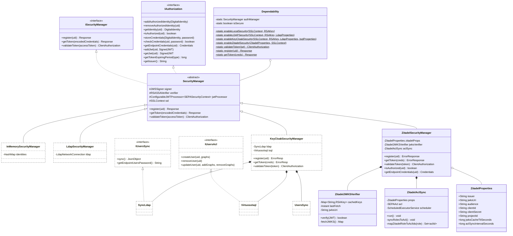

# Zitadel Migration Plan

Vertical design document for migrating the SEPA Engine identity provider
from the current local / LDAP / Keycloak backends to **Zitadel**.

---

## 1. Authentication Data Flow (To-Be)

```mermaid
sequenceDiagram
    participant C as SEPA Client<br/>(Producer/Consumer)
    participant Z as Zitadel IdP
    participant E as SEPA Engine<br/>(ZitadelSecurityManager)
    participant A as SEPAAclProcessor

    C->>Z: POST /oauth/v2/token<br/>grant_type=client_credentials<br/>client_id + client_secret (Machine User)<br/>OR authorization_code (Human User)
    Z-->>C: 200 OK — JWT access_token

    C->>E: SPARQL Request<br/>Authorization: Bearer &lt;JWT&gt;

    E->>E: ZitadelJWKSVerifier<br/>fetch/cached JWKS → verify signature
    E->>E: Validate claims<br/>iss, aud, exp, nbf
    E->>E: Extract sub → identity<br/>Extract roles → graph permissions

    alt JWT invalid or expired
        E-->>C: 401 Unauthorized
    else JWT valid
        E->>A: checkGraph(aclId, graphName, userId)
        A-->>E: allowed / denied
        alt ACL denied
            E-->>C: 403 Forbidden
        else ACL allowed
            E->>E: Proxy to SPARQL Store<br/>with endpoint credentials
            E-->>C: 200 OK — SPARQL Results
        end
    end
```

### Key design decisions

| Decision | Rationale |
|----------|-----------|
| **JWKS verification, not introspection** | Avoids a network round-trip per request. Zitadel publishes rotating JWKS; the engine caches keys and refreshes on `kid` miss or TTL expiry. |
| **Registration/token-issuance externalized** | Like the existing `KeyCloakSecurityManager`, `register()` and `getToken()` return `ErrorResponse(401, "not supported")`. Identity provisioning happens in Zitadel Admin UI/API. |
| **Roles → SEPAAcl sync** | A background `ZitadelAclSync` thread replaces the `SyncLdap → UsersSync → VirtuosoIsql` pipeline. It periodically reads Zitadel project roles/grants and populates the `SEPAAcl` store. |
| **`local` and `ldap` backends retained** | Migration is additive. The `zitadel` security type coexists with existing backends until deprecated. |

---

## 2. Proposed Class Architecture



**Legend**: Dashed borders = deprecated (retained for backward compatibility, removed in next major version).

### How ZitadelSecurityManager hooks into the existing architecture

1. **Startup**: `EngineProperties.setSecurity()` detects `type == "zitadel"` and calls `Dependability.enableZitadelSecurity(props, ssl)`.
2. **Dependability facade**: Stores the `ZitadelSecurityManager` in its static `authManager` field — all existing call sites (`SecureSPARQL11Handler`, `Gate`, `JWTRequestHandler`, `RegisterHandler`) are unchanged.
3. **Token validation**: `ZitadelSecurityManager.validateToken()` uses `ZitadelJWKSVerifier` instead of the Nimbus `ConfigurableJWTProcessor` with engine-owned RSA keys. The JWT issuer is Zitadel, not the engine.
4. **ACL sync**: `ZitadelAclSync` replaces the `SyncLdap → UsersSync → VirtuosoIsql` pipeline. It reads Zitadel project role grants via the Zitadel Management API and populates `SEPAAcl` using the same `addUserPermission()` / `addUserToGroup()` APIs that `SEPAAclProcessor` exposes through JMX.
5. **Identity model**: `isAuthorized(uid)` and `getEndpointCredentials(uid)` no longer need LDAP or in-memory identity stores. Authorization is derived from JWT claims; endpoint credentials come from `ZitadelProperties` (a single service account for the SPARQL store, or per-user credentials mapped from Zitadel metadata).

---

## 3. Identity Mapping Table

| SEPA Concept | Current Implementation | Zitadel Concept | Migration Notes |
|---|---|---|---|
| `ApplicationIdentity` (`objectClass: applicationProcess`) | In-memory HashMap or LDAP `ou=authorizedIdentities` | **Machine User** (Zitadel Service User type) | Machine Users authenticate via client_credentials. The `uid` maps to Zitadel `sub` claim. |
| `DeviceIdentity` (`objectClass: device`) | In-memory HashMap or LDAP `ou=authorizedIdentities` | **Machine User** with device-specific metadata | No native "device" concept in Zitadel. Use Machine User + custom metadata claims (e.g., `device_type`, `device_id`). Token expiry for devices: set via Zitadel project-level token settings. |
| `UserIdentity` (`objectClass: inetOrgPerson`, has `cn` + `sn`) | LDAP `inetOrgPerson` under `ou=credentials` | **Human User** | Zitadel Human Users have `userName`, `displayName`, `email`. The LDAP `cn`/`sn` map to `profile.displayName` / `profile.familyName`. |
| Client registration (`Dependability.register()`) | Engine generates UUID secret, stores credentials | **Application + Service User provisioning** in Zitadel Admin API | Registration is externalized. The engine's `/oauth/register` endpoint returns `401 not supported`. Clients are provisioned via Zitadel console or Management API. |
| Token issuance (`Dependability.getToken()`) | Engine signs JWT with own RSA key | **Zitadel token endpoint** (`/oauth/v2/token`) | The engine's `/oauth/token` endpoint returns `401 not supported`. Clients request tokens directly from Zitadel. |
| Token validation (`Dependability.validateToken()`) | Nimbus `ConfigurableJWTProcessor` with engine's RSA verifier | **JWKS verification** via `ZitadelJWKSVerifier` | Signature verified against Zitadel's published JWKS. Claims (`iss`, `aud`, `exp`, `sub`) validated locally — no introspection endpoint needed. |
| Shared SPARQL endpoint password | Single password from LDAP `uid=endpointUsersPassword` or `InMemorySecurityManager` | **Service Account** or **Personal Access Token (PAT)** | Each Zitadel Machine User can hold a PAT that acts as the SPARQL store credential. Alternatively, a single service account credential stored in `ZitadelProperties`. |
| LDAP groups → Virtuoso ACLs | `SyncLdap.sync()` reads `description` JSON → `UsersSync` → `VirtuosoIsql.createUser()` | **Zitadel Project Roles** → `ZitadelAclSync` → `SEPAAcl` | Zitadel roles (e.g., `graph_reader`, `graph_writer`) map to `DatasetACL.aclId` sets. Role grants on a user define which graphs they can access. |
| Token expiry per identity type | `getTokenExpiringPeriod(device/application/user)` in `IAuthorization` | **Zitadel project-level token settings** | Zitadel supports per-project token lifetimes. The engine-side expiry logic in `IAuthorization` becomes a no-op; Zitadel controls expiry via `exp` claim. |
| JWT issuer | Engine-configured (`https://localhost:8443/oauth/token`) | **Zitadel issuer URL** (e.g., `https://zitadel.example.com`) | `ZitadelProperties.issuer` must match the `iss` claim in Zitadel-issued tokens. |
| JKS keystores (`sepa.jks`) | RSA key pair for JWT signing + SSL | **SSL only** | JWT signing is no longer needed by the engine (Zitadel signs). JKS is still needed for TLS termination at the engine gates. `ZitadelSecurityManager` passes `signingEnabled = false` to `SecurityManager` (same as `KeyCloakSecurityManager`). |

---

## 4. Implementation Action Plan

### Phase 1 — Core infrastructure

#### Classes to create

- `engine/.../dependability/authorization/ZitadelSecurityManager`
  - Extends `SecurityManager`, implements `ISecurityManager` + `IAuthorization`
  - `register()` → `ErrorResponse(401, "not supported", "Registration via Zitadel")`
  - `getToken()` → `ErrorResponse(401, "not supported", "Token issuance via Zitadel")`
  - `validateToken(accessToken)` → parse JWT, verify via `ZitadelJWKSVerifier`, extract `sub` + roles, return `ClientAuthorization(authorized=true, credentials=getEndpointCredentials(sub))`
  - `isAuthorized(uid)` → true if JWT contained valid `sub` (no local identity store needed)
  - `getEndpointCredentials(uid)` → return credentials from `ZitadelProperties` (service account) or PAT lookup

- `engine/.../dependability/authorization/ZitadelJWKSVerifier`
  - Fetches Zitadel JWKS from `ZitadelProperties.jwksUri`
  - Caches RSA keys by `kid`, refreshes on cache TTL expiry or unknown `kid`
  - `boolean verify(SignedJWT)` — checks signature against cached key
  - Thread-safe; uses `ReadWriteLock` for cache access

- `engine/.../dependability/authorization/ZitadelProperties`
  - Fields: `issuer`, `jwksUri`, `audience`, `clientId`, `clientSecret`, `projectId`, `jwksCacheTtlSeconds`, `aclSyncIntervalSeconds`, `endpointUser`, `endpointPassword`
  - Parsed from `engine.jpar` → `gates.security.zitadel` section or CLI args

- `engine/.../dependability/authorization/ZitadelAclSync`
  - Implements `Runnable`, scheduled at fixed rate (`aclSyncIntervalSeconds`)
  - Calls Zitadel Management API: `GET /management/v1/projects/{projectId}/grants` + `GET /management/v1/users`
  - Maps Zitadel role names to `DatasetACL.aclId` sets via configurable role-to-ACL mapping
  - Populates `SEPAAcl` via `addUser()`, `addUserPermission()`, `addUserToGroup()`, `removeUserPermission()`, `removeUser()`
  - Replaces `SyncLdap → UsersSync → VirtuosoIsql` pipeline entirely

- `client-api/.../security/ZitadelAuthenticationService`
  - Extends `AuthenticationService`
  - `registerClient()` → calls Zitadel Management API to create a Machine User + Application
  - `requestToken()` → POST to Zitadel `/oauth/v2/token` with `grant_type=client_credentials`
  - Mirrors `KeycloakAuthenticationService` but targets Zitadel REST endpoints

#### Classes to modify

- **`Dependability`**
  - Add `enableZitadelSecurity(ZitadelProperties, SSLContext)` method
  - Creates `ZitadelSecurityManager` and assigns to `authManager`
  - Add `isZitadelEnabled()` helper

- **`EngineProperties`**
  - Add `ZitadelProperties` inner class with fields from `engine.jpar` → `gates.security.zitadel`
  - Modify `setSecurity()` to route `type == "zitadel"` → `Dependability.enableZitadelSecurity(...)`
  - Add `isZitadelEnabled()` method
  - Parse CLI args: `-zitadel.issuer`, `-zitadel.jwksUri`, `-zitadel.audience`, `-zitadel.clientId`, `-zitadel.clientSecret`, `-zitadel.projectId`

- **`EngineBeans`**
  - Add `getZitadelIssuer()`, `getZitadelJwksUri()`, `isZitadelEnabled()` accessors for JMX visibility

- **`engine.jpar` schema**
  - Add `zitadel` object under `gates.security`:
    ```json
    "zitadel": {
      "issuer": "https://zitadel.example.com",
      "jwksUri": "https://zitadel.example.com/.well-known/jwks.json",
      "audience": "https://sepa.vaimee.com",
      "clientId": "sepa-engine",
      "clientSecret": "...",
      "projectId": "123456789",
      "jwksCacheTtlSeconds": 3600,
      "aclSyncIntervalSeconds": 30,
      "endpointUser": "sepa",
      "endpointPassword": "sepa2020"
    }
    ```

- **`SEPAAcl`**
  - No structural changes needed — `ZitadelAclSync` uses the same `addUserPermission()` / `addUserToGroup()` API
  - Uncomment the `SEPAAclProcessor jmx` field to enable JMX ACL management (currently commented out at `SEPAAcl.java:31`)

### Phase 2 — Client-api integration

- **`client-api/.../security/ClientSecurityManager`**
  - Add detection logic: if JSAP `oauth.type == "zitadel"` → instantiate `ZitadelAuthenticationService` instead of `DefaultAuthenticationService` / `KeycloakAuthenticationService`

- **`client-api/.../properties/OAuthProperties`** (or equivalent JSAP parsing)
  - Add `zitadel` fields: `registerUrl` → Zitadel Management API, `tokenRequestUrl` → Zitadel token endpoint

### Phase 3 — Deprecation and cleanup

#### Classes to deprecate (add `@Deprecated` annotation, keep functional)

- `KeyCloakSecurityManager` — replaced by `ZitadelSecurityManager`
- `LdapSecurityManager` — replaced by `ZitadelSecurityManager`
- `SyncLdap` — replaced by `ZitadelAclSync`
- `VirtuosoIsql` — replaced by `ZitadelAclSync` (ACLs go to `SEPAAcl`, not to Virtuoso ISQL)
- `UsersSync` — replaced by `ZitadelAclSync`
- `IUsersSync` — no longer needed
- `IUsersAcl` — no longer needed
- `LdapProperties` — replaced by `ZitadelProperties`
- `IsqlProperties` — replaced by `ZitadelProperties`
- `KeycloakAuthenticationService` (client-api) — replaced by `ZitadelAuthenticationService`
- `Dependability.enableKeyCloakSecurity()` — deprecated, use `enableZitadelSecurity()`
- `Dependability.enableLDAPSecurity()` — deprecated, use `enableZitadelSecurity()`

#### Classes to remove (next major version, after Zitadel is production-stable)

- All deprecated classes listed above
- `engine.jpar` `gates.security.type` values `"ldap"` and `"keycloak"` (keep `"local"` for dev/test, add `"zitadel"`)
- CLI args: `-ldaphost`, `-ldapport`, `-ldapdn`, `-ldappwd`, `-isqlpath`, `-isqlhost`, `-isqluser`, `-isqlpass`
- JKS JWT signing config (`jwtstore`, `jwtalias`, `jwtaliaspass`) — only needed for `local` and `ldap` backends

### Phase 4 — Documentation and testing

- Update `README.md` security section to document Zitadel configuration
- Add `endpoint-zitadel.jpar` template to `engine/src/main/resources/endpoints/`
- Add `zitadel.jsap` client template with Zitadel OAuth URLs
- Write integration tests: `ITZitadelSecurityManager.java` (requires running Zitadel instance)
- Write unit tests: `ZitadelJWKSVerifierTest.java` (mock JWKS endpoint)
- Write unit tests: `ZitadelAclSyncTest.java` (mock Zitadel Management API)
- Update `ACLManager` CLI tool to support Zitadel as backend
- Update `AGENTS.md` with Zitadel build/test prerequisites

---

### Appendix — Zitadel Role-to-ACL Mapping

The `ZitadelAclSync` component requires a configurable mapping from Zitadel project roles
to `DatasetACL.aclId` permission sets. The default mapping:

| Zitadel Role | `DatasetACL.aclId` Set | SPARQL Capability |
|---|---|---|
| `sepa_query` | `{aiQuery}` | SELECT queries |
| `sepa_update` | `{aiQuery, aiUpdate, aiInsertData, aiDeleteData}` | SELECT + UPDATE |
| `sepa_admin` | `{aiQuery, aiUpdate, aiInsertData, aiDeleteData, aiCreate, aiDrop, aiClear}` | Full graph control |
| `sepa_subscribe` | `{aiQuery}` | SELECT queries + WebSocket subscribe |

The mapping is defined in `ZitadelProperties` and can be overridden in `engine.jpar`:

```json
"zitadel": {
  ...
  "roleAclMapping": {
    "sepa_query": ["query"],
    "sepa_update": ["query", "update", "insertdata", "deletedata"],
    "sepa_admin": ["query", "update", "insertdata", "deletedata", "create", "drop", "clear"],
    "sepa_subscribe": ["query"]
  }
}
```

Role-to-graph binding is determined by Zitadel **project grant** metadata:
each grant can carry a `graphUris` field (stored as Zitadel user metadata)
listing the named graphs the role applies to.
