# Client API — Pattern & API Class Diagram

> Packages: `com.vaimee.sepa.api.pattern`, `com.vaimee.sepa.api`

```mermaid
classDiagram
    direction TB

    class ISubscriptionHandler {
        <<interface>>
        +onSemanticEvent(Notification)
        +onBrokenConnection(ErrorResponse)
        +onError(ErrorResponse)
        +onSubscribe(String spuid, String alias)
        +onUnsubscribe(String spuid)
    }

    class IProducer {
        <<interface>>
        +update() Response
        +update(long timeout, long nRetry) Response
    }

    class IConsumer {
        <<interface>>
        +subscribe()
        +subscribe(long timeout, long nRetry)
        +unsubscribe()
        +unsubscribe(long timeout, long nRetry)
        +onResults(ARBindingsResults)
        +onAddedResults(BindingsResults)
        +onRemovedResults(BindingsResults)
        +onFirstResults(BindingsResults)
    }

    IConsumer --|> ISubscriptionHandler : extends

    class Client {
        <<abstract>>
        #appProfile : JSAP
        #sm : ClientSecurityManager
        +isSecure() boolean
        +close()
    }

    class Producer {
        -SPARQL_ID : String
        -forcedBindings : ForcedBindings
        -multipleForcedBindings : MultipleForcedBindings
        -client : SPARQL11Protocol
        +update() Response
        +update(long, long) Response
        +multipleUpdate() Response
        +multipleUpdate(long, long) Response
        +setUpdateBindingValue(String variable, RDFTerm value)
    }

    class Consumer {
        <<abstract>>
        -subID : String
        -forcedBindings : ForcedBindings
        -client : SPARQL11SEProtocol
        -protocol : SubscriptionProtocol
        +subscribe()
        +subscribe(long, long)
        +unsubscribe()
        +unsubscribe(long, long)
        +setSubscribeBindingValue(String variable, RDFTerm value)
        +isSubscribed() boolean
    }

    class Aggregator {
        <<abstract>>
        -updateId : String
        -updateForcedBindings : ForcedBindings
        -sparql11 : SPARQL11Protocol
        +update() Response
        +update(long, long) Response
        +multipleUpdate() Response
        +multipleUpdate(long, long) Response
        +setUpdateBindingValue(String variable, RDFTerm value)
    }

    class GenericClient {
        -handler : ISubscriptionHandler
        -client : SPARQL11Protocol
        +update(String ID, Bindings forced) Response
        +query(String ID, Bindings forced) Response
        +subscribe(String ID, Bindings forced)
        +unsubscribe(String subID)
        +setHandler(ISubscriptionHandler handler)
    }

    Producer --|> Client : extends
    Producer ..|> IProducer : implements
    Consumer --|> Client : extends
    Consumer ..|> IConsumer : implements
    Aggregator --|> Consumer : extends
    Aggregator ..|> IProducer : implements
    GenericClient --|> Client : extends
    GenericClient ..|> ISubscriptionHandler : implements

    class JSAP {
        -host : String
        -queries : HashMap~String, QueryPrimitive~
        -updates : HashMap~String, UpdatePrimitive~
        -namespaces : HashMap~String, String~
        -prefixes : Namespaces
        +isSecure() boolean
        +reconnect() boolean
        +getSPARQLUpdate(String id) String
        +getSPARQLQuery(String id) String
        +getUpdateBindings(String id) ForcedBindings
        +getQueryBindings(String id) ForcedBindings
        +addPrefixesAndReplaceBindings(String sparql, Bindings) String
        +addPrefixesAndReplaceMultipleBindings(String sparql, ArrayList~Bindings~) String
        +merge(JSAP other)
        +read(Reader in, boolean replace)
    }

    class JSAPPrimitive {
        <<abstract>>
        +sparql : String
        +forcedBindings : HashMap~String, ForcedBinding~
        +sparql11protocol : SPARQL11ProtocolProperties
        +graphs : GraphsProperties
    }

    class QueryPrimitive {
        +sparql11seprotocol : SPARQL11SEProtocolProperties
    }

    class UpdatePrimitive

    JSAPPrimitive <|-- QueryPrimitive
    JSAPPrimitive <|-- UpdatePrimitive

    Client --> JSAP : appProfile
    JSAP *-- QueryPrimitive : queries
    JSAP *-- UpdatePrimitive : updates
    JSAP --> Namespaces : prefixes

    class Bindings {
        +addBinding(String variable, RDFTerm value)
        +getVariables() Set~String~
        +isLiteral(String variable) boolean
        +isURI(String variable) boolean
        +isEmpty() boolean
    }

    class ForcedBindings {
        +setBindingValue(String variable, RDFTerm value)
    }

    class MultipleForcedBindings {
        -multipleForcedBindings : ArrayList~Bindings~
        +add(ArrayList~String~ variables, ArrayList~ArrayList~RDFTerm~~ values)
        +getBindings() ArrayList~Bindings~
    }

    Bindings <|-- ForcedBindings
    ForcedBindings <|-- MultipleForcedBindings

    Producer --> ForcedBindings : forcedBindings
    Producer --> MultipleForcedBindings : multipleForcedBindings
    Consumer --> ForcedBindings : forcedBindings
    Aggregator --> ForcedBindings : updateForcedBindings
    GenericClient --> ISubscriptionHandler : handler

    class SPARQL11Protocol {
        +query(QueryRequest request) Response
        +update(UpdateRequest request) Response
    }

    class SPARQL11SEProtocol {
        -subscriptionProtocol : SubscriptionProtocol
        +subscribe(SubscribeRequest request)
        +unsubscribe(UnsubscribeRequest request)
    }

    class SubscriptionProtocol {
        <<abstract>>
        #handler : ISubscriptionHandler
        +subscribe(SubscribeRequest request)*
        +unsubscribe(UnsubscribeRequest request)*
    }

    SPARQL11Protocol <|-- SPARQL11SEProtocol
    SPARQL11SEProtocol --> SubscriptionProtocol : subscriptionProtocol
    SubscriptionProtocol --> ISubscriptionHandler : handler

    Producer --> SPARQL11Protocol : client
    Consumer --> SPARQL11SEProtocol : client
    Consumer --> SubscriptionProtocol : protocol
    Aggregator --> SPARQL11Protocol : sparql11
    GenericClient --> SPARQL11Protocol : client
```

## Key relationships

| Relationship | Meaning |
|---|---|
| `Client` → `JSAP` | Every client holds a reference to the application profile (JSAP) which provides SPARQL templates, endpoints, and forced bindings |
| `JSAP` ◆─ `QueryPrimitive` / `UpdatePrimitive` | JSAP composes query and update primitives parsed from the `.jsap` file |
| `Producer` ── `SPARQL11Protocol` | Producer sends SPARQL updates via HTTP |
| `Consumer` ── `SPARQL11SEProtocol` | Consumer subscribes/unsubscribes via the SE protocol (WebSocket) |
| `Aggregator` extends `Consumer` + implements `IProducer` | Aggregator combines subscription listening with update capability |
| `SubscriptionProtocol` → `ISubscriptionHandler` | Protocol delegates semantic events back to the handler |
| `ForcedBindings` extends `Bindings` | Extends the base SPARQL solution with mutability for runtime binding replacement |
