# Engine Core — Class Diagram

> Packages: `engine.core`, `engine.processing`, `engine.processing.endpoint`, `engine.processing.subscriptions`, `engine.scheduling`, `engine.dependability`, `engine.dependability.authorization`, `engine.dependability.authorization.identities`, `engine.dependability.acl`, `engine.dependability.acl.storage`

```mermaid
classDiagram
    direction TB

    subgraph Core_Orchestration
        class Engine {
            -properties : EngineProperties
            -scheduler : Scheduler
            -processor : Processor
            -httpGate : HttpGate
            -wsServer : WebsocketServer
            +shutdown()
        }
        class EngineProperties {
            -endpointProperties : SPARQL11Properties
            -parameters : Parameters
            +isSecure() boolean
            +isLDAPEnabled() boolean
            +isLocalEnabled() boolean
            +isKeycìCloakEnabled() boolean
            +getHttpPort() int
            +getWsPort() int
            +isAclEnabled() boolean
            +getAclType() String
        }
    end

    subgraph Scheduling
        class Scheduler {
            -queue : SchedulerQueue
            -responders : HashMap~int, ResponseHandler~
            +schedule(InternalRequest, ResponseHandler) ScheduledRequest
            +waitQueryRequest() ScheduledRequest
            +waitUpdateRequest() ScheduledRequest
            +waitSubscribeRequest() ScheduledRequest
            +waitUnsubscribeRequest() ScheduledRequest
            +addResponse(int token, Response ret)
        }
    end

    subgraph Core_Processing
        class Processor {
            -queryProcessor : QueryProcessor
            -updateProcessor : UpdateProcessor
            -spuManager : SPUManager
            -queryProcessingThread : QueryProcessingThread
            -updateProcessingThread : UpdateProcessingThread
            -subscribeProcessingThread : SubscribeProcessingThread
            -unsubscribeProcessingThread : UnsubscribeProcessingThread
            -scheduler : Scheduler
            +start()
            +processQuery(InternalQueryRequest) Response
            +processUpdate(InternalUpdateRequest) Response
            +processSubscribe(InternalSubscribeRequest) Response
            +processUnsubscribe(String sid, String gid) Response
        }

        class QueryProcessor {
            -endpoint : SPARQLEndpoint
            +process(InternalQueryRequest) Response
        }

        class UpdateProcessor {
            -endpoint : SPARQLEndpoint
            +process(InternalUpdateRequest) Response
        }
    end

    subgraph Endpoint_Strategy
        class SPARQLEndpoint {
            <<interface>>
            +query(QueryRequest, SEPAUserInfo) Response
            +update(UpdateRequest, SEPAUserInfo) Response
        }

        class JenaInMemoryEndpoint {
            -dataset : Dataset
            +query(QueryRequest, SEPAUserInfo) Response
            +update(UpdateRequest, SEPAUserInfo) Response
        }

        class RemoteEndpoint {
            -endpoint : SPARQL11Protocol
            +query(QueryRequest) Response
            +update(UpdateRequest) Response
        }

        class JenaDatasetFactory {
            +newInstance(String mode, String path, DatasetACL acl)$ Dataset
            +newInstance(String mode, String path, boolean useACLIfPossible)$ Dataset
        }
    end

    subgraph SPU_Subscription_Lifecycle
        class EventHandler {
            <<interface>>
            +notifyEvent(Notification)
            +ping() boolean
        }

        class ISPU {
            <<interface>>
            +getSPUID() String
            +init() Response
            +getLastBindings() BindingsResults
            +postUpdateProcessing(Response)
            +preUpdateProcessing(InternalUpdateRequest)
        }

        class SPU {
            <<abstract>>
            #spuid : String
            #lastBindings : BindingsResults
            #manager : SPUManager
            +postUpdateInternalProcessing(UpdateResponse) Notification*
            +preUpdateInternalProcessing(InternalUpdateRequest)*
            +run()
        }

        class SPUNaive {
            +init() Response
            +preUpdateInternalProcessing(InternalUpdateRequest)
            +postUpdateInternalProcessing(UpdateResponse) Notification
        }

        class SPUManager {
            -activeSpus : Collection~SPU~
            -processingPool : Collection~SPU~
            -processor : Processor
            +subscribe(InternalSubscribeRequest) Response
            +unsubscribe(String sid, String gid) Response
            +subscriptionsProcessingPreUpdate(InternalUpdateRequest)
            +subscriptionsProcessingPostUpdate(Response)
            +notifyEvent(Notification)
            +ping() boolean
        }

        class Subscriptions {
            <<utility>>
            -subscribers : HashMap~String, Subscriber~$
            -handlers : HashMap~String, HashSet~Subscriber~~$
            -requests : HashMap~InternalSubscribeRequest, SPU~$
            -spus : HashMap~String, SPU~$
            +createSPU(InternalSubscribeRequest, SPUManager)$ SPU
            +filterOnGraphs(InternalUpdateRequest)$ Collection~SPU~
            +registerSubscribe(InternalSubscribeRequest, SPU)$
            +addSubscriber(InternalSubscribeRequest, SPU)$ Subscriber
            +removeSubscriber(String)$ boolean
            +notifySubscribers(Notification)$
        }

        class Subscriber {
            -spu : SPU
            -sid : String
            +getSID() String
            +getSPU() SPU
            +notifyEvent(Notification)
            +ping() boolean
        }
    end

    subgraph Security_Facade
        class Dependability {
            -isSecure : boolean$
            -authManager : SecurityManager$
            +enableLocalSecurity(SSLContext, RSAKey)$
            +enableLDAPSecurity(SSLContext, RSAKey, LdapProperties)$
            +enableKeyCloakSecurity(SSLContext, RSAKey, LdapProperties, IsqlProperties)$
            +register(String identity)$ Response
            +getToken(String encodedCredentials)$ Response
            +validateToken(String jwt)$ ClientAuthorization
            +getSSLContext()$ SSLContext
        }

        class ISecurityManager {
            <<interface>>
            +register(String uid) Response
            +getToken(String encodedCredentials) Response
            +validateToken(String accessToken) ClientAuthorization
        }

        class IAuthorization {
            <<interface>>
            +addAuthorizedIdentity(DigitalIdentity)
            +removeAuthorizedIdentity(String uid)
            +isAuthorized(String identity) boolean
            +storeCredentials(DigitalIdentity, String secret) boolean
            +checkCredentials(String uid, String secret) boolean
            +getEndpointCredentials(String uid) Credentials
            +addJwt(String id, SignedJWT)
            +containsJwt(String id) boolean
            +getJwt(String uid) SignedJWT
            +validateToken(String accessToken) ClientAuthorization
            +getTokenExpiringPeriod(String id) long
        }
    end

    subgraph Authorization_Implementations
        class SecurityManager {
            <<abstract>>
            #signer : JWSSigner
            #verifier : RSASSAVerifier
            #jwtProcessor : ConfigurableJWTProcessor
            -ssl : SSLContext
            +register(String uid) Response
            +getToken(String encodedCredentials) Response
            +validateToken(String accessToken) ClientAuthorization
            +getSSLContext() SSLContext
        }

        class InMemorySecurityManager {
            -identities : HashMap~String, AuthorizedIdentity~
            +addAuthorizedIdentity(DigitalIdentity)
            +isAuthorized(String uid) boolean
            +storeCredentials(DigitalIdentity, String) boolean
            +checkCredentials(String uid, String secret) boolean
        }

        class LdapSecurityManager {
            -ldap : LdapNetworkConnection
            -prop : LdapProperties
            +addAuthorizedIdentity(DigitalIdentity)
            +isAuthorized(String uid) boolean
            +storeCredentials(DigitalIdentity, String) boolean
            +checkCredentials(String uid, String secret) boolean
            +getEndpointCredentials(String uid) Credentials
        }

        class KeyCloakSecurityManager {
            -ldap : SyncLdap
            -isql : VirtuosoIsql
            +register(String uid) Response
            +getToken(String encodedCredentials) Response
            +validateToken(String accessToken) ClientAuthorization
            +getEndpointCredentials(String uid) Credentials
        }
    end

    subgraph Authorization_Keycloak_LDAP
        class IUsersSync {
            <<interface>>
            +sync() JsonObject
            +getEndpointUsersPassword() String
        }

        class IUsersAcl {
            <<interface>>
            +createUser(String uid, JsonElement graphs)
            +removeUser(String uid)
            +updateUser(String uid, JsonObject addGraphs, JsonArray removeGraphs)
        }

        class SyncLdap {
            -ldap : LdapNetworkConnection
            -prop : LdapProperties
            +sync() JsonObject
            +getEndpointUsersPassword() String
        }

        class VirtuosoIsql {
            -endpointUsersPassword : String
            -ps : ProcessBuilder
            +createUser(String uid, JsonElement graphs)
            +removeUser(String uid)
            +updateUser(String uid, JsonObject, JsonArray)
        }

        class UsersSync {
            -ldap : IUsersSync
            -isql : IUsersAcl
        }

        class LdapProperties {
            -host : String
            -port : int
            -base : String
            -user : String
            -pass : String
            -tls : boolean
        }

        class IsqlProperties {
            -isqlPath : String
            -isqlHost : String
            -isqlUser : String
            -isqlPass : String
        }
    end

    subgraph Identity_Model
        class DigitalIdentity {
            <<abstract>>
            -uid : String
            -endpointCredentials : Credentials
            +getUid() String
            +getObjectClass()* String
            +getEndpointCredentials() Credentials
            +setEndpointCredentials(String user, String secret)
        }

        class ApplicationIdentity {
            +getObjectClass() String
        }

        class DeviceIdentity {
            +getObjectClass() String
        }

        class UserIdentity {
            -commonName : String
            -surname : String
            +getObjectClass() String
            +getCommonName() String
            +getSurname() String
        }
    end

    subgraph ACL_Storage
        class SEPAAcl {
            -aclStorage : ACLStorageOperations
            -cachedACL : Map~String, UserData~
            -cachedGroupsACL : Map
            +newInstance(ACLStorageOperations)$ SEPAAcl
            +getInstance()$ SEPAAcl
            +addUser(String)
            +addUserPermission(String, String, aclId)
            +removeUser(String)
            +addUserToGroup(String, String)
            +addGroup(String)
            +addGroupPermission(String, String, aclId)
            +checkGraphBase(aclId, String, String) boolean
            +listUsers() Map
            +listGroups() Map
        }

        class ACLStorage {
            <<interface>>
            +loadUsers() Map
            +loadGroups() Map
            +addUser(String)
            +removeUser(String)
            +addUserPermission(String, String, aclId)
            +removeUserPermission(String, String, aclId)
            +addGroup(String)
            +addGroupPermission(String, String, aclId)
        }

        class ACLStorageOperations {
            <<interface>>
            +addGraphToUser(String, String, aclId)
            +addGraphToGroup(String, String, aclId)
        }

        class ACLStorageListable {
            <<interface>>
            +listUsers() Map
            +listGroups() Map
            +viewUser(String) UserData
            +viewGroup(String) Map
        }

        class ACLStorageDataset {
            -storageDataset : Dataset
            -dsConnection : RDFConnection
            +loadUsers() Map
            +loadGroups() Map
            +addUser(String)
            +addUserPermission(String, String, aclId)
        }

        class ACLStorageJSon {
            -jsonFile : String
            -jsonArchive : JSonArchive
            +loadUsers() Map
            +loadGroups() Map
            +addUser(String)
            +addUserPermission(String, String, aclId)
        }

        class SEPAAclProcessor {
            +reloadUsers() String
            +reloadGroups() String
            +listUsers() Map
            +listGroups() Map
            +addUser(String) String
            +addUserPermission(String, String, String) String
            +removeUser(String) String
        }

        class SEPAUserInfo {
            +userName : String
            +newInstance(String)$ SEPAUserInfo
        }
    end

    Engine --> EngineProperties : properties
    Engine --> Scheduler : scheduler
    Engine --> Processor : processor

    Processor --> QueryProcessor : queryProcessor
    Processor --> UpdateProcessor : updateProcessor
    Processor --> SPUManager : spuManager
    Processor --> Scheduler : scheduler

    QueryProcessor --> SPARQLEndpoint : endpoint
    UpdateProcessor --> SPARQLEndpoint : endpoint

    SPARQLEndpoint <|.. JenaInMemoryEndpoint : implements
    SPARQLEndpoint <|.. RemoteEndpoint : implements
    JenaInMemoryEndpoint --> JenaDatasetFactory : creates dataset via
    JenaInMemoryEndpoint --> SEPAUserInfo : uses for ACL-aware connections

    EventHandler <|.. SPUManager : implements
    ISPU <|.. SPU : implements
    SPU <|-- SPUNaive : extends
    SPU --> SPUManager : manager
    SPUManager --> Processor : processor
    SPUManager --> Subscriptions : delegates to
    Subscriptions --> Subscriber : manages
    Subscriber --> SPU : spu

    Dependability --> SecurityManager : authManager

    ISecurityManager <|.. SecurityManager : implements
    IAuthorization <|.. SecurityManager : implements
    SecurityManager <|-- InMemorySecurityManager : extends
    SecurityManager <|-- LdapSecurityManager : extends
    SecurityManager <|-- KeyCloakSecurityManager : extends

    KeyCloakSecurityManager --> SyncLdap : ldap
    KeyCloakSecurityManager --> VirtuosoIsql : isql
    KeyCloakSecurityManager --> UsersSync : creates

    IUsersSync <|.. SyncLdap : implements
    IUsersAcl <|.. VirtuosoIsql : implements
    UsersSync --> IUsersSync : ldap
    UsersSync --> IUsersAcl : isql

    LdapSecurityManager --> LdapProperties : prop
    KeyCloakSecurityManager --> LdapProperties : via SyncLdap
    KeyCloakSecurityManager --> IsqlProperties : via VirtuosoIsql

    DigitalIdentity <|-- ApplicationIdentity : extends
    DigitalIdentity <|-- DeviceIdentity : extends
    DigitalIdentity <|-- UserIdentity : extends

    SEPAAcl --|> DatasetACL : extends
    ACLStorage <|.. SEPAAcl : implements
    ACLStorageListable <|.. SEPAAcl : implements
    ACLStorageOperations <|-- ACLStorage : extends
    ACLStorageOperations <|.. ACLStorageDataset : implements
    ACLStorageOperations <|.. ACLStorageJSon : implements
    SEPAAcl --> ACLStorageOperations : aclStorage
    SEPAAclProcessor --> SEPAAcl : JMX bridge to
```

## Key relationships

| Relationship | Meaning |
|---|---|
| `Engine` → `EngineProperties`, `Scheduler`, `Processor` | Engine is the orchestrator; creates config, scheduler, and processor at startup |
| `Processor` → `QueryProcessor`, `UpdateProcessor`, `SPUManager` | Processor is the central dispatcher; owns SPARQL processors and subscription manager |
| `QueryProcessor`/`UpdateProcessor` → `SPARQLEndpoint` | Strategy pattern: delegate to Jena in-memory or remote HTTP endpoint |
| `JenaInMemoryEndpoint` → `JenaDatasetFactory` | Dataset creation is centralized; factory decides TDB1/TDB2/memory + ACL wrapping |
| `SPUManager` implements `EventHandler` | SPUManager receives notifications from SPUs and dispatches them to subscribers |
| `SPU` → `SPUManager` | Each SPU references its manager for end-of-processing signaling and query delegation |
| `Subscriptions` is static utility | Manages SID↔SPU↔Subscriber maps with graph-based filtering; no instances, all static methods |
| `Dependability` → `SecurityManager` | Static facade/singleton; factory methods select InMemory/LDAP/Keycloak implementation |
| `SecurityManager` implements `ISecurityManager` + `IAuthorization` | Abstract base provides JWT sign/verify; subclasses implement identity/credential storage |
| `KeyCloakSecurityManager` → `SyncLdap` + `VirtuosoIsql` | Keycloak delegates register/getToken to Keycloak; uses LDAP sync + Virtuoso ISQL for user→graph ACL propagation |
| `UsersSync` → `IUsersSync` + `IUsersAcl` | Polling thread (5 s) syncs LDAP users → Virtuoso graph permissions; the sync surface Zitadel must replace |
| `DigitalIdentity` hierarchy | SEPA's identity model: Application (objectClass=`applicationProcess`), Device (`device`), User (`inetOrgPerson`); must map to Zitadel's Human/Machine users |
| `SEPAAcl` extends `DatasetACL` | Bridges Jena's ACL library with SEPA's storage backends; caches ACL in memory, persists via `ACLStorageOperations` |
| `ACLStorageDataset` / `ACLStorageJSon` | Concrete ACL persistence: Jena TDB dataset or JSON file; both implement `ACLStorageOperations` |
| `SEPAAclProcessor` → `SEPAAcl` | JMX MBean that exposes ACL CRUD operations via reflection; not a processing component |
| `SEPAUserInfo` → `JenaInMemoryEndpoint` | Carries the username for ACL-aware `RDFConnection` creation; connects authorization to data access |
| `EngineProperties.setSecurity()` → `Dependability.enable*Security()` | Config-driven security bootstrap: reads `engine.jpar` → creates the appropriate SecurityManager |
